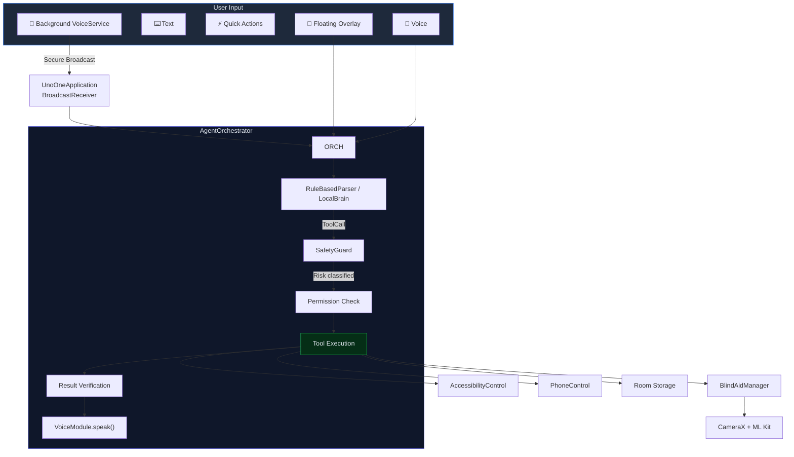

<div align="center">

<br/>


<br/>

> **Investor & Competition Note**
>
> UnoOne is a **pre-launch, patent-pending** on-device AI platform. The architecture, safety-gate design, compound-command parsing, and blind-aid navigation pipeline described below represent novel, defensible intellectual property. This repository contains proprietary source code and trade secrets. Distribution, reverse engineering, or public disclosure without written authorization is prohibited. For partnership, investment, or competition review inquiries, contact the founding team directly.

<br/>

# 🧠 UnoOne Agent

### *Your Phone. Your Intelligence. Your Privacy.*

> A fully offline Android AI companion — voice commands, deep app control, sensory blind-aid navigation, and background voice routing — all running on-device with zero cloud dependency.

<p align="center">
  
  
  
  
</p>

<p align="center">
  
  
  
  
  
  
</p>

</div>

---

## ✨ Why UnoOne

| Problem | UnoOne's Answer |
|---|---|
| Cloud AI assistants send your voice, contacts, and screen content to remote servers | **100% on-device** — no data leaves the phone, ever |
| Voice assistants can't control your apps | **AccessibilityService deep control** — tap, type, fill, swipe, read any screen |
| Blind and low-vision users lack real-time spatial awareness | **Live blind-aid navigation** with camera, haptics, tone beeps, and spoken guidance |
| Background listening requires internet | **Offline wake-word + VAD** with package-local broadcast routing |
| AI assistants execute destructive commands without safeguards | **4-tier safety gate** (DIRECT → CONFIRM → STRONG_CONFIRM → BLOCK) |

---

## 📋 Table of Contents

- [About UnoOne](#about-unoone)
- [Architecture](#architecture)
- [Core Capabilities](#core-capabilities)
- [Blind Aid Vision System](#blind-aid-vision-system)
- [Voice Pipeline](#voice-pipeline)
- [Command Parser](#command-parser)
- [Safety Framework](#safety-framework)
- [Language Support](#language-support)
- [Hardware Requirements](#hardware-requirements)
- [Build & Test](#build--test)
- [Project Structure](#project-structure)

---

## 🏗️ About UnoOne

UnoOne is a **modular, offline-first Android AI agent** that transforms a smartphone into a fully voice-controllable, accessibility-powered, spatially-aware companion — with zero cloud dependency. Built on 13 independent Gradle modules, it combines:

- **Privacy-first command execution** — every action runs locally, no data leaves the device
- **Accessibility-based deep UI control** — tap, type, fill, swipe, long-press, read any screen through Android's AccessibilityService
- **Live camera-aided sensory navigation** — real-time object detection with haptic, tonal, and spoken guidance for blind and low-vision users
- **End-to-end background voice routing** — wake-word detection to command dispatch, entirely offline
- **Safety-gated automation** — a 4-tier risk classifier prevents destructive actions without explicit user confirmation
- **Compound command intelligence** — natural language chains like *"scroll down and go home"* are parsed and executed as atomic sequences with per-part safety checks

The entire system shares a **single VoiceModule instance** across the Application, Orchestrator, ViewModel, and FloatingAgentService — eliminating resource conflicts and ensuring unified TTS/STT lifecycle management.

---

## 🏛️ Architecture



### Module Map (13 modules)

| Module | Responsibility | Key Files |
|---|---|---|
| `:app` | Compose UI, overlay service, orchestration, permissions | `MainActivity`, `AgentOrchestrator`, `AgentScreen`, `FloatingAgentService`, `AgentViewModel` |
| `:core` | Shared models (`Result`, `ToolCall`, `AgentStatus`, `TimelineStep`) and logging | `Result.kt`, `ToolCall.kt`, `Logger.kt` |
| `:storage` | Room DB — notes, skills, memory entities and DAOs | `UnoOneDatabase.kt` |
| `:modelmanager` | Model folder detection, checksum verification, storage usage | `ModelManager.kt` |
| `:localbrain` | Parser, prompt helpers, ONNX wrapper, RAG utility layer | `RuleBasedParser.kt`, `LocalBrain.kt` |
| `:voice` | Recorder, STT/TTS engines, foreground voice service, broadcast routing | `VoiceModule.kt`, `AndroidSttEngine.kt`, `VoiceService.kt` |
| `:agentrouter` | Tool registration and fallback routing | `AgentRouter.kt` |
| `:safetyguard` | 4-tier risk classification policy | `SafetyGuard.kt` |
| `:phonecontrol` | App intents, OCR, object detection, blind aid analyzer | `PhoneControl.kt`, `BlindAidManager.kt` |
| `:memory` | Preference, correction, and pattern retrieval | `MemoryModule.kt` |
| `:skills` | Skill CRUD and trigger execution | `SkillsModule.kt` |
| `:observability` | Local diagnostics helpers | `Diagnostics.kt` |
| `:accessibilitycontrol` | Gestures, input, context capture, visible text extraction | `UnoOneAccessibilityService.kt`, `AccessibilityControl.kt` |

---

## 🚀 Core Capabilities

### Voice & Text Command Pipeline

The 8-step orchestrator processes every command through a structured pipeline:

```
LISTENING → TRANSCRIBING → UNDERSTANDING → TOOL_SELECTED → SAFETY_CHECK → EXECUTING → VERIFYING → SPEAKING → DONE
```

Each step is displayed in real-time on the **Agent Flow Timeline** with color-coded status indicators and progress bar.

### Accessibility Deep Control

| Action | Method | Safety Tier |
|---|---|---|
| Tap any text on screen | `clickNodeWithText()` | DIRECT |
| Type into focused field | `typeTextIntoFocused()` | DIRECT |
| Fill a field with specific text | `fillFieldWithText()` | DIRECT |
| Long-press a UI element | `longPressNodeWithText()` | DIRECT |
| Swipe in any direction | `swipe()` | DIRECT |
| Scroll up / down | `scrollUp()` / `scrollDown()` | DIRECT |
| Read all visible text | `captureVisibleText()` | DIRECT |
| Find and click with delay | `findAndClick()` (suspend) | CONFIRM+ |

All accessibility methods use **try/finally node recycling** to prevent `AccessibilityNodeInfo` memory leaks — `rootNode` and every child node are properly `recycle()`d.

### Compound Commands

The parser intelligently splits compound commands while preserving domain-specific semantics:

| Input | Parsed As | Why |
|---|---|---|
| *"scroll down and go home"* | `compound(system_control, system_control)` | Both halves are simple navigation |
| *"create skill called greeting to say hello and wave goodbye"* | `create_skill(steps: ["say hello", "wave goodbye"])` | `"and"` inside skill steps is preserved, not split |
| *"open chrome and search for cats"* | `compound(open_chrome, system_control)` | Two distinct tools |
| *"remember to buy milk"* | `create_note(content: "buy milk")` | `"to"` after "remember" is stripped |

Domain-specific keywords (`teach you`, `create skill`, `email`, `whatsapp`, `calendar`) are checked **before** compound splitting to prevent semantic destruction.

### Note & Skill Creation

- **Notes**: `"remember: pick up groceries"`, `"add note buy milk"`, `"remember to call mom"`
- **Skills**: `"create skill called greeting to say hello and wave goodbye"` — multi-step skills with `"and"` preserved
- **Long press**: `"long press on settings"` — correctly extracts the target

---

## 👁️ Blind Aid Vision System

### How It Works

1. **Voice activation**: Say *"activate blind aid"*, *"what's in front of me"*, *"detect barriers"*, or *"obstacles"*
2. **Parser** maps these to `detect_objects` (safety tier: **STRONG_CONFIRM**)
3. **Orchestrator** toggles blind-aid state, speaks confirmation, and brings the app to the foreground if needed
4. **UI** mounts `BlindAidCameraPreview` with live camera feed
5. **BlindAidManager** analyzes frames at ~5 FPS using ML Kit object detection
6. **Feedback** arrives via three simultaneous channels:
   - 📳 **Haptics** — vibration intensity scales with obstacle proximity
   - 🔊 **Tone beeps** — dynamic rate audio cues for distance
   - 🗣️ **Spoken guidance** — throttled voice announcements ("obstacle 2 meters ahead")

### Deactivation

Say *"stop blind aid"*, *"deactivate blind aid"*, *"turn off blind aid"*, *"stop scanning"*, *"stop barriers"*, *"remove obstacles"*, *"disable barriers"*, or *"no more barriers"* — all mapped to `deactivate_blind_aid` at **DIRECT** safety tier (no confirmation needed — instant stop).

### Camera Pipeline

| Component | Behavior |
|---|---|
| `BlindAidCameraPreview` | One-time camera binding in `factory` block (no rebind flicker), `ProcessCameraProvider` lifecycle-bound, unbinds on `DisposableEffect` dispose |
| `BlindAidManager` | Processes 1 in 6 frames (~5 FPS), attempts custom YOLOv8 model, falls back to ML Kit defaults |
| Custom model path | `Android/data/com.unoone.agent/files/models/gemma-local/custom_yolov8.tflite` |

---

## 🎤 Voice Pipeline

### In-App Path (Foreground)

```
AgentScreen mic button → VoiceModule.startRecording() → amplitude visualization → VoiceModule.stopAndTranscribe() → AgentOrchestrator.processCommand()
```

- Waveform visualizer driven by Android STT `onRmsChanged` decibel levels
- Conflict-free microphone resource management
- Single shared `VoiceModule` instance across the entire app lifecycle

### Background Path (VoiceService)

```
VoiceService wake-word detection → VAD filtering → STT transcription → secure package-local broadcast → UnoOneApplication BroadcastReceiver → AgentOrchestrator.processCommand()
```

- **End-to-end wired**: Commands detected in the background service are broadcast with `RECEIVER_NOT_EXPORTED` and immediately dispatched to the orchestrator on the main thread
- **Background activation**: Commands like *"activate blind aid"* received via broadcast will bring `MainActivity` to the foreground for camera binding
- **Secure**: Intent is package-scoped (`setPackage(packageName)`) — no cross-app leakage

### Shared VoiceModule Architecture

A single `VoiceModule` instance is created in `UnoOneApplication` and shared across all consumers:

| Consumer | VoiceModule Source |
|---|---|
| `UnoOneApplication` (broadcast receiver) | `app.sharedVoiceModule` → injected into orchestrator |
| `AgentViewModel` | Constructor parameter from `app.sharedVoiceModule` |
| `FloatingAgentService` | `orchestrator.voiceModule` (same instance) |
| `VoiceService` | Owns separate STT/TTS/keyword-spotting engines (by design — background lifecycle) |

This eliminates the resource conflicts and memory leaks that would arise from multiple `VoiceModule` instances fighting over the microphone.

---

## 🔎 Command Parser

The `RuleBasedParser` uses a priority-ordered `when` block that checks **domain-specific rules first** (skills, email, WhatsApp, calendar), then compound commands, then general rules. Key features:

| Feature | Behavior |
|---|---|
| Blind aid activation | 6 phrases → `detect_objects` |
| Blind aid deactivation | 8 phrases → `deactivate_blind_aid` (with negative-intent patterns: stop, remove, turn off, deactivate, disable, no more) |
| Note creation | `"remember: ..."`, `"add note ..."`, `"remember to ..."` (strips grammatical "to") |
| Compound commands | Splits on `" and "` — only when no domain-specific keywords present |
| Long press | `"long press on X"` → extracts target text |
| Fill fields | Regex handles `"with"`, `":"`, and single-space separators |
| Fallback | Unrecognized input → `LocalBrain.runInference()` (currently returns mock JSON) |

### Test Coverage

9 unit tests covering activation triggers, deactivation triggers, note creation (with and without colon), "remember to" stripping, compound commands, domain-specific preservation, long press, and activation/deactivation disambiguation — all passing.

---

## 🛡️ Safety Framework

Every command passes through a **4-tier risk classifier** before execution:

| Risk Level | Behavior | Tools |
|---|---|---|
| **DIRECT** | Execute immediately, no confirmation | `create_note`, `search_notes`, `summarize_text`, `speak_response`, `open_chrome`, `open_app`, `deactivate_blind_aid` |
| **CONFIRM** | Single confirmation dialog | `open_url`, `open_calendar_insert`, `open_dialer`, `share_text` |
| **STRONG_CONFIRM** | Must type "confirm" to proceed | `delete_notes`, `delete_all_notes`, `export_data`, `detect_objects` |
| **BLOCK** | Hard block — never executed | `send_message`, `make_payment`, `install_app`, `access_passwords`, `silent_control` |

**Default**: Any unrecognized tool → `STRONG_CONFIRM`

**Compound commands**: Each half is independently classified and permission-checked. A compound like *"open chrome and delete all notes"* will execute `open_chrome` (DIRECT) and then prompt for strong confirmation on `delete_all_notes` (STRONG_CONFIRM).

**Blind aid**: Activation = `STRONG_CONFIRM` (privacy protection for continuous camera access). Deactivation = `DIRECT` (instant stop, no hurdles).

---

## 🌐 Language Support

### Speech Recognition (7 Languages)

| Language | Locale | Notes |
|---|---|---|
| English (India) | `en-IN` | Primary/default |
| Hindi | `hi-IN` | Full support |
| Tamil | `ta-IN` | Full support |
| Telugu | `te-IN` | Full support |
| Kannada | `kn-IN` | Full support |
| Malayalam | `ml-IN` | Full support |
| Bengali | `bn-IN` | Full support |

### Speech Synthesis

| Language | Locale |
|---|---|
| English (India) | `en-IN` |
| Hindi | `hi-IN` |
| Tamil | `ta-IN` |
| Telugu | `te-IN` |

---

## 🖥️ Hardware Requirements

| Tier | Profile | Use Case |
|---|---|---|
| **Baseline** | Android 9+ (API 28), ARM64, 4 GB RAM, 1 GB storage, microphone | Voice commands, text input, accessibility control |
| **Recommended** | Android 12+, 6–8 GB RAM, rear camera, vibration motor, 2+ GB storage | Full blind-aid + voice UX |
| **Expert** | 8+ GB RAM (12+ preferred), NPU-capable chipset, multi-GB model storage | Local LLM inference via ONNX |

---

## 🔧 Build & Test

```bash
# From android-app/UnoOneAgent

# Run unit tests
./gradlew.bat :app:testDebugUnitTest

# Compile debug build
./gradlew.bat :app:assembleDebug

# Compile check (faster, no APK)
./gradlew.bat :app:compileDebugKotlin
```

---

## 📁 Project Structure

```
UnoOne-Local-Agent/
├── README.md                          ← You are here
├── android-app/
│   └── UnoOneAgent/
│       ├── app/                        # Main app module
│       │   └── src/main/java/com/unoone/agent/
│       │       ├── UnoOneApplication.kt    # App entry, shared VoiceModule, BroadcastReceiver
│       │       ├── AgentOrchestrator.kt     # 8-step command pipeline
│       │       ├── AgentViewModel.kt        # ViewModel with shared VoiceModule
│       │       ├── FloatingAgentService.kt  # 24/7 overlay, lifecycle-managed
│       │       ├── MainActivity.kt          # Compose host
│       │       └── ui/
│       │           ├── screens/AgentScreen.kt   # Main UI + BlindAidCameraPreview
│       │           ├── viewmodel/AgentViewModel.kt
│       │           ├── components/             # ConfirmationDialog, WaveformVisualizer
│       │           └── theme/                  # Material 3 theme
│       ├── voice/                       # Voice module
│       │   └── src/main/java/com/unoone/agent/voice/
│       │       ├── VoiceModule.kt           # Unified STT/TTS manager (shared singleton)
│       │       ├── VoiceService.kt           # Background wake-word + broadcast routing
│       │       └── stt/AndroidSttEngine.kt   # Multilingual STT with double-destroy guard
│       ├── localbrain/                  # Parser module
│       │   └── RuleBasedParser.kt           # Priority-ordered command parser
│       ├── safetyguard/                 # Safety module
│       │   └── SafetyGuard.kt               # 4-tier risk classifier
│       ├── accessibilitycontrol/        # Accessibility module
│       │   ├── UnoOneAccessibilityService.kt  # Node recycling, try/finally guards
│       │   └── AccessibilityControl.kt       # suspend fun findAndClick, swipe, longPress
│       ├── phonecontrol/               # Phone control module
│       │   └── BlindAidManager.kt           # CameraX + ML Kit analyzer (5 FPS)
│       └── ...                         # Remaining 8 modules
└── .aiexclude                          # Excludes build/cache/model paths from AI scanning
```

---

## 📊 Implementation Status

| Capability | Status | Details |
|---|---|---|
| Compose app shell + floating overlay | ✅ Implemented | Material 3 UI, drag bubble, chat overlay |
| 8-step orchestrator pipeline | ✅ Implemented | Parse → permission → safety → execute → verify → speak |
| Accessibility deep control | ✅ Implemented & hardened | All nodes properly recycled, suspend `findAndClick()` |
| Blind Aid live camera + analyzer | ✅ Implemented & live | CameraX, ML Kit, haptics + tones + spoken guidance |
| Background voice routing | ✅ End-to-end | VoiceService → broadcast → orchestrator |
| Compound command parsing | ✅ Implemented | Domain-safe splitting with per-part safety checks |
| Safety framework (4-tier) | ✅ Implemented | DIRECT, CONFIRM, STRONG_CONFIRM, BLOCK |
| Parser unit tests | ✅ 9/9 passing | Activation, deactivation, notes, compound, long press |
| Shared VoiceModule architecture | ✅ Implemented | Single instance across Application, ViewModel, Orchestrator, Overlay |
| LocalBrain inference | 🔧 Scaffold | `runInference()` returns mock JSON placeholder |
| RAG integration | 🔧 Scaffold | `RAGManager` exists, not wired into runtime |
| Custom bounding-box overlay | 🔧 Planned | Detection results computed but no Compose overlay drawn |

---

## 📄 Documentation

- **Root overview** (this file)
- **Android technical implementation**: [`android-app/UnoOneAgent/README.md`](android-app/UnoOneAgent/README.md)

---

<div align="center">

*UnoOne — One private AI agent for every phone action.*

</div>