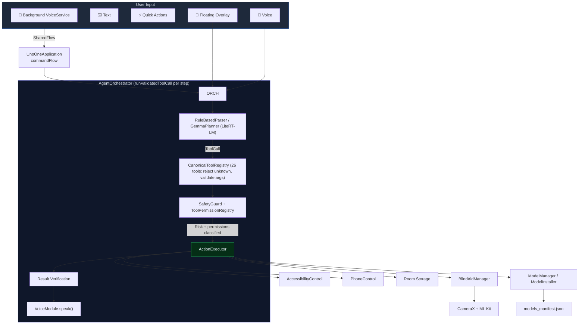

<div align="center">

# 🧠 UnoOne Agent

### *Your Phone. Your Intelligence. Your Privacy.*

> An offline-first Android AI companion — voice commands, deep app control, sensory blind-aid navigation, and background voice routing — running on-device. Core voice, notes, device control, and planning work locally with models installed; optional web search and Android system fallbacks are user-controlled, clearly labeled, and off by default.

<p align="center">
  <a href="https://www.startupindia.gov.in" target="_blank" rel="noopener noreferrer">
    
  </a>
  <br>
  <sub><b>Uni Guru Technologies LLP</b> · Recognised under Startup India in <b>AI &amp; Machine Learning</b> · Certificate No. <b>DPIIP268963</b></sub>
</p>

<p align="center">
  
  
  
  
</p>

<p align="center">
  
  
  
  
  
  
  
  
</p>

</div>

---

## ✨ Why UnoOne

| Problem | UnoOne's Answer |
|---|---|
| Cloud AI assistants send your voice, contacts, and screen content to remote servers | **100% on-device** — no data leaves the phone, ever |
| Voice assistants can't control your apps | **AccessibilityService deep control** — tap, type, fill, swipe, read any screen |
| Blind and low-vision users lack real-time spatial awareness | **Live blind-aid navigation** with camera, haptics, tone beeps, and spoken guidance |
| Background listening requires internet | **Offline wake-word + VAD** routed through an in-app `SharedFlow` — no cross-app broadcast, no cloud |
| AI assistants execute destructive commands without safeguards | **4-tier safety gate** (DIRECT → CONFIRM → STRONG_CONFIRM → BLOCK) applied per-step, even inside skills and compound chains |
| "Offline" assistants silently fall back to cloud speech | **Sherpa-ONNX is the default STT/TTS**; Android system speech is an *opt-in* emergency fallback, off by default — the agent fails loudly ("install model") instead of leaking to the cloud |
| On-device LLMs fail hard on devices without a GPU | **GPU→CPU fallback** for Gemma, with memory-pressure unload + transparent reload |

---

## 📋 Table of Contents

- [About UnoOne](#about-unoone)
- [Architecture](#architecture)
- [Model Manifest & Installer](#model-manifest--installer)
- [Core Capabilities](#core-capabilities)
- [Blind Aid Vision System](#blind-aid-vision-system)
- [Voice Pipeline](#voice-pipeline)
- [Local Brain (Gemma via LiteRT-LM)](#local-brain-gemma-via-litert-lm)
- [Command Parser](#command-parser)
- [Safety Framework](#safety-framework)
- [Permissions](#permissions)
- [Language Support](#language-support)
- [Hardware Requirements](#hardware-requirements)
- [Build & Test](#build--test)
- [Project Structure](#project-structure)
- [Implementation Status](#implementation-status)
- [Accuracy & Verification](#accuracy--verification)
- [Known Gaps](#known-gaps)

---

## 🏗️ About UnoOne

UnoOne is a **modular, offline-first Android AI agent** that transforms a smartphone into a fully voice-controllable, accessibility-powered, spatially-aware companion. Built on 13 independent Gradle modules and powered by an on-device **Gemma** brain via **LiteRT-LM**, it combines:

- **Privacy-first command execution** — every action runs locally, no data leaves the device
- **On-device LLM planning** — a selectable Gemma brain plans complex actions through LiteRT-LM manual tool calling, with automatic GPU→CPU backend fallback. The default is **Gemma 3n E4B** (the device-verified fallback); **Gemma 4 E2B** is available as an **Experimental** profile the user opts into (not the default — not device-verified yet). Every model-proposed tool call is checked against a **CanonicalToolRegistry** of 26 tools — unknown tools are rejected and required arguments are schema-validated before anything executes. Five agent innovations sit on top: a ReAct agentic loop, an LLM safety judge, a calibration eval harness, outcome-learned memory, streaming inference, a diagnostics self-heal loop, a multimodal-vision `describe_scene` tool, and signed-manifest integrity — each with its control/scoring logic JVM-tested and its LiteRT-LM inference device-time-only
- **Real offline speech** — Sherpa-ONNX STT/TTS as the default voice layer; Android `SpeechRecognizer`/`TextToSpeech` demoted to an opt-in emergency fallback (off by default), so the agent never silently routes speech to a cloud-dependent system service
- **Manifest-driven model lifecycle** — a real model manifest + installer with HTTP resume, SHA-256/size verification, corrupt-file recovery, atomic commit, and on-disk health checks (replaces loose folder detection)
- **Accessibility-based deep UI control** — tap, type, fill, swipe, long-press, read any screen through Android's AccessibilityService
- **Live camera-aided sensory navigation** — real-time object detection with haptic, tonal, and spoken guidance for blind and low-vision users
- **End-to-end background voice routing** — wake-word detection to command dispatch over an in-app `SharedFlow`, entirely offline
- **Safety-gated automation** — a 4-tier risk classifier applied **per step**, including inside skills and compound commands; the LLM proposes, the app validates and executes
- **Compound command intelligence** — natural language chains like *"scroll down and go home"* are parsed into an ordered `steps[]` array and executed as atomic sequences with per-step safety checks

The entire system shares a **single VoiceModule instance** across the Application, Orchestrator, ViewModel, and FloatingAgentService — eliminating resource conflicts and ensuring unified TTS/STT lifecycle management.

---

## 🏛️ Architecture



### Module Map (13 modules)

| Module | Responsibility | Key Files |
|---|---|---|
| `:app` | Compose UI, overlay service, orchestration, permissions, SharedFlow command collector, new Settings sub-screens | `MainActivity`, `AgentOrchestrator`, `AgentScreen`, `FloatingAgentService`, `AgentViewModel`, `ModelStatusScreen`, `VoiceTestScreen`, `AuditViewerScreen`, `DataExporter` |
| `:core` | Shared models, logging, single-source permission registry, **brain model profiles + CanonicalToolRegistry**, extractive summarizer | `Result.kt`, `ToolCall.kt`, `Logger.kt`, `model/BrainModel.kt`, `model/CanonicalToolRegistry.kt`, `safety/ToolPermissionRegistry.kt`, `safety/PermissionRequirement.kt`, `util/TextSummarizer.kt` |
| `:storage` | Room DB — notes, skills, memory entities and DAOs (incl. `searchOnce`/`deleteByQuery`/`deleteAll`/`recent`) | `UnoOneDatabase.kt`, `dao/NoteDao.kt`, `dao/ModelMetadataDao.kt` |
| `:modelmanager` | Manifest loader, on-disk health, install/uninstall, model discovery, `.litertlm` discovery | `ModelManager.kt`, `ModelInstaller.kt`, `ModelManifest.kt`, `ModelManifestLoader.kt`, `assets/models_manifest.json` |
| `:localbrain` | Parser, prompt builder, model-profile-aware Gemma / LiteRT-LM planner (GPU→CPU fallback, inference Mutex + 30s timeout), manual tool calling, CanonicalToolRegistry agreement, RAG utility, enriched context snapshot | `RuleBasedParser.kt`, `GemmaPlanner.kt`, `LocalBrain.kt`, `UnoOneToolSet.kt`, `ContextSnapshot.kt`, `PromptBuilder.kt` |
| `:voice` | Recorder, Sherpa STT/TTS engines (default), Android fallback engines (opt-in), foreground voice service, SharedFlow command routing | `VoiceModule.kt`, `VoiceService.kt`, `stt/SherpaSttEngine.kt`, `tts/SherpaTtsEngine.kt`, `stt/KeywordSpotter.kt`, `recorder/AudioRecorder.kt` |
| `:agentrouter` | Tool registration and plugin routing | `AgentRouter.kt` |
| `:safetyguard` | 4-tier risk classification policy | `SafetyGuard.kt` |
| `:phonecontrol` | App intents, OCR, object detection, blind aid analyzer | `PhoneControl.kt`, `BlindAidManager.kt`, `OcrControl.kt` |
| `:memory` | Preference, correction, and pattern retrieval | `MemoryModule.kt` |
| `:skills` | Skill CRUD and trigger execution | `SkillsModule.kt` |
| `:observability` | Local diagnostics helpers | `Diagnostics.kt` |
| `:accessibilitycontrol` | Gestures, input, context capture, visible text extraction | `UnoOneAccessibilityService.kt`, `AccessibilityControl.kt` |

---

## 📦 Model Manifest & Installer

UnoOne replaced loose "does this folder exist?" model detection with a **real manifest + installer system**. The manifest (`modelmanager/src/main/assets/models_manifest.json`) is the source of truth for every on-device model; the installer downloads, verifies, and repairs them.

### Manifest schema

Each model descriptor declares `id, folder, type, version, minRamMb, backend, defaultLanguage, files[]`. Each file declares `name, url, sha256, sizeBytes, archive, asset?, extractsTo?`. `asset` (optional) names a file bundled in the app's `assets/` — when set, the installer copies it from the APK instead of downloading `url` (used for the espeak-ng-data phoneme table). `extractsTo` (optional) names the top directory an archive extracts to — required for tarballs whose top dir differs from the archive name (e.g. `sherpa-onnx-whisper-tiny.tar.bz2` → `sherpa-onnx-whisper-tiny/`) and for `.tar.bz2` whose double extension breaks the strip-last-extension fallback; when unset, health/skip fall back to stripping the last extension of `name`.

| Model id | Type | Backend | What it is |
|---|---|---|---|
| `gemma-3n-e4b` | llm | any (GPU→CPU) | Gemma 3n E4B `.litertlm` — the **default** planning brain (device-verified fallback). Folder stays `gemma-local/` for migration continuity; a legacy `gemma-local` selection resolves to this profile |
| `gemma-4-e2b` | llm | any (GPU→CPU) | Gemma 4 E2B `.litertlm` (128K context, ~2.58 GB, Apache 2.0) — **Experimental** selectable profile, not the default and not device-verified yet. `sha256`/`sizeBytes` left empty until a real artifact is integrity-measured (no fabrication) |
| `sherpa-asr-en` | asr | cpu | Streaming zipformer-transducer **int8** ASR (English) — `csukuangfj/sherpa-onnx-streaming-zipformer-en-2023-06-26` |
| `sherpa-asr-whisper` | asr | cpu | Multilingual **whisper-tiny int8** ASR (shared by hi/bn/ta/te/kn/ml) — `k2-fsa/sherpa-onnx` whisper-tiny tarball; `language` field selects the language at runtime |
| `vad` | vad | cpu | Streaming zipformer-transducer **int8** keyword spotting / wake-word (English — no Indic KWS model exists) |
| `sherpa-tts-en` | tts | cpu | VITS Coqui **en-ljspeech** neural TTS (English) — `csukuangfj/vits-coqui-en-ljspeech` + bundled espeak-ng-data |
| `sherpa-tts-hin/ben/tam/tel/kan/mal` | tts | cpu | **MMS VITS** neural TTS per Indian language — `willwade/mms-tts-multilingual-models-onnx` (character frontend, no espeak) |
| `punctuation` | punctuation | cpu | Punctuation restoration model (English) |
| `ocr-optional` | ocr | cpu | Optional OCR model (URL left blank) |

### Installer capabilities (`ModelInstaller`)

Real, dependency-free (plain `HttpURLConnection`):

- **Resume** — sends `Range: bytes=N-` against an existing `.part`; appends on `206`, restarts cleanly on `200`.
- **Atomic commit** — downloads to `name.part` then renames to the final name, so a crash never leaves a half-written final file.
- **Integrity verification** — SHA-256 + size check, but only when the manifest actually declares them.
- **Asset-backed files** — a file with an `asset` field is copied from the bundled APK `assets/` (not downloaded), then verified and (for archives) extracted. This ships the espeak-ng-data phoneme table (~9 MB, language-independent, stable) inside the APK so offline English TTS installs with **no network and no 355 individual downloads**.
- **Archive extraction (zip + tar)** — ZIP via `java.util.zip`; tar.bz2 / tar.gz via Apache commons-compress (Android's stdlib has no tar/bzip2), so a manifest entry can point at a public model tarball (the whisper-tiny `.tar.bz2`) without re-hosting its contents.
- **Archive health** — archives are deleted after extraction, so health and install-skip verify the *extracted directory* (named by `extractsTo`, else the strip-last-extension of `name`) rather than the (deleted) archive — a successfully installed archive is not falsely reported missing.
- **Empty-file guard** — a 0-byte file with no declared integrity is **not** trusted as valid (forces re-download instead of silently skipping).
- **Corrupt recovery** — on size/checksum mismatch, deletes the bad file and retries exactly once.
- **HTTP 416 recovery** — if a prior run finished downloading but crashed before the `.part→final` rename, the installer commits directly without the network (otherwise a "Range Not Satisfiable" response would make re-install fail forever).
- **Connection safety** — `HttpURLConnection.disconnect()` in `finally` (no connection leak on mid-stream exception).
- **Zip-slip guard** — archive entries are canonical-path-checked before extraction.
- **Idempotent** — files already present and valid are skipped (safe across app restarts).

### `ModelManager` surface

- `loadManifest()` / `findModel(id)` — manifest parse + lookup
- `modelHealth(id): HealthResult` — verifies every declared file exists and matches its declared size/SHA-256 (when declared); reports `missing`/`sizeMismatch`/`checksumMismatch`
- `installModel(id, onProgress)` / `uninstallModel(id)` — with a **path-traversal guard** (the resolved folder must stay inside the models root; a malformed id like `../..` or a tampered manifest `folder` is refused)
- `detectModels()` — merges manifest info (version, expected vs actual size/checksum, health) into `ModelStatus`
- `getLlmModelPath()` — finds the first `.litertlm` under `gemma-local/`

### ✅ Shipped models (verified, integrity-checked)

The shipped manifest is filled with **real, verified model URLs + SHA-256 hashes + byte sizes** — offline STT/TTS/wake-word for **English + 6 Indian languages** install and verify end-to-end with no manual configuration. Every hash/size was stream-computed from the actual artifact bytes (no fabrication).

**English:**

- **`sherpa-asr-en`** and **`vad`** share the public streaming-zipformer English int8 transducer (`encoder`/`decoder`/`joiner`/`tokens` from `csukuangfj/sherpa-onnx-streaming-zipformer-en-2023-06-26`). STT uses Sherpa's **Online (streaming) recognizer** drained single-shot (`while (isReady) decode`) — the only public, ungated English transducer on Hugging Face is the streaming one. The wake-word `KeywordSpotter` uses the same Online model family, so STT and KWS share one model install.
- **`sherpa-tts-en`** is the Coqui en-ljspeech VITS model (`model.onnx` + `tokens.txt` from `csukuangfj/vits-coqui-en-ljspeech`) plus the **espeak-ng-data phoneme table bundled as an app asset** (`espeak-ng-data.zip`, ~9 MB) — extracted at install time, with no 355 individual HTTP downloads.

**Indian languages (Hindi / Bengali / Tamil / Telugu / Kannada / Malayalam):**

- **`sherpa-asr-whisper`** — a single multilingual **whisper-tiny int8** model (the `sherpa-onnx-whisper-tiny.tar.bz2` public tarball) shared by all six languages. `SherpaSttEngine` runs it via Sherpa's **offline-Whisper path** (`OfflineRecognizer` + `OfflineWhisperModelConfig(encoder, decoder, language, task="transcribe")`), decoded one-shot, with the 2-letter language code (hi/bn/ta/te/kn/ml) set per utterance. There is **no public Sherpa transducer for these languages**, so whisper-tiny is the lightest viable offline ASR (~103 MB of int8 weights; whisper-small is ~480 MB and can be swapped in by changing one manifest entry). The tarball is extracted with commons-compress into `sherpa-onnx-whisper-tiny/` (named via `extractsTo`); integrity is verified against the tarball's SHA-256.
- **`sherpa-tts-hin/ben/tam/tel/kan/mal`** — one **MMS VITS** model per language from `willwade/mms-tts-multilingual-models-onnx` (`model.onnx` + `tokens.txt`, ~114 MB each, character frontend — no espeak needed). `SherpaTtsEngine` auto-detects the frontend: an `espeak-ng-data/` dir present ⇒ Coqui (English) config, else ⇒ MMS config with `dataDir=""` (Sherpa derives the character frontend from model metadata).

What is **not** pre-filled (by design — content, not code):

- **`gemma-3n-e4b`** and **`gemma-4-e2b`** carry their real Hugging Face URLs but leave `sha256`/`sizeBytes` empty (the installer still validates download completeness via the HTTP response). Fill the hashes to enable strict integrity checking for the exact Gemma variant you ship. Do **not** treat Gemma 4 E2B as working until it loads and performs a tool call on a physical device — see [DEVICE_VERIFICATION.md](DEVICE_VERIFICATION.md).
- **`punctuation`** carries its real Hugging Face URL with empty `sha256`/`sizeBytes`.
- **`ocr-optional`** has no URL (OCR is optional and not wired into the default tool set).

The user picks the active language in **Settings → Voice language** (en/hi/bn/ta/te/kn/ml); it is persisted in `unoone_settings` and `VoiceService` + the shared `VoiceModule` rebuild their STT/TTS engines for it live (the wake-word stays English regardless). Install the matching models from **Model Status & Install**. The installer and health system enforce integrity the moment the fields are populated.

The **Model Status & Install** screen (Settings → Model Status) surfaces every model's version, size, health, backend, and install/uninstall with a live progress bar, so this is operable from the UI. It also hosts the **Brain Model** section (see [Local Brain](#local-brain-gemma-via-litert-lm)) for selecting the active Gemma profile and running an on-device self-test.

---

## 🚀 Core Capabilities

### Voice & Text Command Pipeline

The orchestrator processes every command through a structured pipeline:

```
LISTENING → TRANSCRIBING → UNDERSTANDING → TOOL_SELECTED → SAFETY_CHECK → EXECUTING → VERIFYING → SPEAKING → DONE
```

Each step is displayed in real-time on the **Agent Flow Timeline** with color-coded status indicators and progress bar. A shared `runValidatedToolCall` runs the safety pipeline (permissions → risk → block/confirm → execute → audit) and is reused for normal commands, **each step of a compound command**, and **each step of a skill** — so skills and compounds can no longer bypass safety.

### Tool coverage

`CanonicalToolRegistry` defines the **26 tools** the agent may execute (the same set `UnoOneToolSet` advertises to Gemma — agreement is enforced by `ToolRegistryAgreementTest`). Every one of them has a **real executor branch** in `ActionExecutor` (no orphaned "Unknown tool" fallthrough to `AgentRouter`):

| Tool | Backed by | Notes |
|---|---|---|
| `create_note`, `search_notes`, `delete_notes`, `delete_all_notes` | `NoteDao` | `searchOnce` / `deleteByQuery` / `deleteAll` |
| `summarize_text` | `TextSummarizer` | Extractive (no ML dep) — first N sentences / ~30% |
| `speak_response` | `VoiceModule.speak()` | Injected callback, same as blind-aid callback |
| `export_data` | `DataExporter` | Notes+skills+memory+logs → JSON in cache → share URI |
| `open_app`, `open_url`, `share_text`, `open_dialer`, `open_calendar_insert` | `PhoneControl` | `PackageResolver` for app_name→package |
| `open_chrome`, `open_camera` | `PhoneControl` | |
| `read_screen` | Accessibility tree only | Errors cleanly if blank — no spurious MediaProjection prompt |
| `ocr_screen` | `OcrControl` | Gated on `ScreenshotCapture.hasPermission()` |
| `describe_scene` | `OcrControl` + `SceneDescriptionBuilder` | Screen scene from OCR + foreground context (vision path INACTIVE) |
| `create_skill` | `SkillsModule.saveSkill` | `steps` accepts a JSON array or `|`-string |
| `check_calendar` | Calendar provider | `READ_CALENDAR` |
| `detect_objects` / `deactivate_blind_aid` | `BlindAidManager` | |

### Compound Commands

The parser splits compound commands into an ordered `steps[]` JSON array (up to 3 parts), each parsed independently and executed through the shared safety pipeline:

| Input | Parsed As | Why |
|---|---|---|
| *"scroll down and go home"* | `compound(steps: [system_control(scroll_down), system_control(go_home)])` | Both halves are simple navigation |
| *create skill called greeting to say hello and wave goodbye* | `create_skill(steps: ["say hello", "wave goodbye"])` | `"and"` inside skill steps is preserved, not split |
| *"open chrome and search for cats"* | `compound(steps: [open_chrome, open_url(google search "cats")])` | `"search for X"` → Google search URL via `open_url` |
| *"remember to buy milk"* | `create_note(content: "buy milk")` | `"to"` after "remember" is stripped |

Domain-specific keywords (`teach you`, `create skill`, `email`, `whatsapp`, `calendar`) are checked **before** compound splitting to prevent semantic destruction. `ToolCall.compoundSteps()` expands a compound call into `List<ToolCall>` for the orchestrator.

### Note & Skill Creation

- **Notes**: `"remember: pick up groceries"`, `"add note buy milk"`, `"remember to call mom"`
- **Skills**: `"create skill called greeting to say hello and wave goodbye"` — multi-step skills with `"and"` preserved; skill steps are routed through safety per-step (a skill containing a `delete_all_notes` step requires STRONG_CONFIRM; a blocked step blocks the skill)
- **Long press**: `"long press on settings"` — correctly extracts the target

---

## 👁️ Blind Aid Vision System

### How It Works

1. **Voice activation**: Say *"activate blind aid"*, *"what's in front of me"*, *"detect barriers"*, or *"obstacles"*
2. **Parser** maps these to `detect_objects` (safety tier: **STRONG_CONFIRM**)
3. **Orchestrator** toggles blind-aid state, speaks confirmation, and brings the app to the foreground if needed (works from the background `SharedFlow` path too)
4. **UI** mounts `BlindAidCameraPreview` with live camera feed
5. **BlindAidManager** analyzes frames at ~5 FPS using ML Kit object detection and publishes normalized bounding boxes + the upright image aspect ratio to a `StateFlow`
6. **Feedback** arrives via four simultaneous channels:
   - 📳 **Haptics** — vibration intensity scales with obstacle proximity
   - 🔊 **Tone beeps** — dynamic rate audio cues for distance
   - 🗣️ **Spoken guidance** — throttled voice announcements ("obstacle 2 meters ahead")
   - 🟧 **Bounding-box overlay** — `BlindAidCameraPreview` draws a Compose `Canvas` over the live preview, mapping each detected object's normalized box through FILL_CENTER so boxes track objects on screen

### Deactivation

Say *"stop blind aid"*, *"deactivate blind aid"*, *"turn off blind aid"*, *"stop scanning"*, *"stop barriers"*, *"remove obstacles"*, *"disable barriers"*, or *"no more barriers"* — all mapped to `deactivate_blind_aid` at **DIRECT** safety tier (no confirmation needed — instant stop).

### Camera Pipeline

| Component | Behavior |
|---|---|
| `BlindAidCameraPreview` | One-time camera binding in `factory` block (no rebind flicker), `ProcessCameraProvider` lifecycle-bound, unbinds on `DisposableEffect` dispose |
| `BlindAidManager` | Processes 1 in 6 frames (~5 FPS), attempts custom YOLOv8 model, falls back to ML Kit defaults |
| Custom model path | `Android/data/com.unoone.agent/files/models/gemma-local/custom_yolov8.tflite` |

---

## 🎤 Voice Pipeline

### Offline-first by default

The voice layer is **Sherpa-ONNX** for both STT and TTS. A `VoiceRuntimeState` machine tracks the real engine state and feeds the UI's offline-mode chip:

| State | Meaning | UI chip |
|---|---|---|
| `SHERPA` | Real offline Sherpa engine active | **OFFLINE** (green) |
| `SYSTEM_FALLBACK` | Emergency Android `SpeechRecognizer`/`TextToSpeech` active (opt-in only) | **LIMITED** (amber) |
| `UNAVAILABLE` | No STT model and fallback disabled | **NO MODEL** (red) |

Android system speech is gated behind `allowSystemSttFallback` (default **false**). When Sherpa is unavailable and the fallback is off, the voice layer returns an explicit `Result.Error("Offline STT model not installed…")` so the UI surfaces "install model" — it never silently routes speech to a cloud-dependent system service. The fallback follows the device's system locales when enabled.

**STT engine:** `SherpaSttEngine` uses Sherpa's **Online (streaming) recognizer** with the streaming-zipformer English int8 transducer. A whole captured utterance is fed to a fresh `OnlineStream` and the decoder is drained (`while (isReady(stream)) decode(stream)`) so the streaming model behaves as a single-shot transcriber — preserving the engine's `transcribe(pcmBytes) -> Result<String>` contract. The wake-word `KeywordSpotterEngine` uses the same Online model family (encoder/decoder/joiner/tokens), so STT and KWS install the same model. If the native `.so` fails to load on a device, init degrades gracefully (`Result.Error`) — never crashes.

### STT confidence + retry

Sherpa exposes a per-utterance confidence; `lastSttConfidence` is set from the real engine result (Android fallback: 1.0f on non-blank, 0.0f on blank). The orchestrator treats confidence **below 0.6** as low-confidence and emits a *"Low confidence — please repeat"* timeline step with a single retry, rather than acting on a shaky transcription.

### In-App Path (Foreground)

```
AgentScreen mic button → VoiceModule.startRecording() → amplitude visualization → VoiceModule.stopAndTranscribe() → AgentOrchestrator.processCommand()
```

- Waveform visualizer driven by recorder amplitude
- Conflict-free microphone resource management
- Single shared `VoiceModule` instance across the entire app lifecycle

### Background Path (VoiceService)

```
VoiceService wake-word detection → VAD filtering → STT transcription → in-app SharedFlow (commandFlow) → UnoOneApplication.collect() → AgentOrchestrator.processCommand()
```

- **End-to-end wired over an in-app `SharedFlow`** (`commandFlow`): commands detected in the background service are emitted to `_commandFlow.tryEmit(command)` and collected by `UnoOneApplication`, then dispatched to the orchestrator. This keeps transcribed speech inside the app process — no cross-app `Intent` broadcast, nothing in system logs.
- **Background activation**: Commands like *"activate blind aid"* received via the flow bring `MainActivity` to the foreground for camera binding.

### Shared VoiceModule Architecture

A single `VoiceModule` instance is created in `UnoOneApplication` and shared across all consumers:

| Consumer | VoiceModule Source |
|---|---|
| `UnoOneApplication` (SharedFlow collector) | `app.sharedVoiceModule` → injected into orchestrator |
| `AgentViewModel` | Constructor parameter from `app.sharedVoiceModule` |
| `FloatingAgentService` | `orchestrator.voiceModule` (same instance) |
| `VoiceService` | Owns separate STT/TTS/keyword-spotting engines (by design — background lifecycle) |

This eliminates the resource conflicts and memory leaks that would arise from multiple `VoiceModule` instances fighting over the microphone.

### Voice Test screen

Settings → **Voice Test (STT / TTS)** lets a user record 3s → transcribe (Sherpa) → see text + confidence, and type text → `speak()` (Sherpa TTS) → playback, with the active engine shown — so offline voice can be verified before relying on it.

---

## 🧠 Local Brain (Gemma via LiteRT-LM)

`GemmaPlanner` wraps **LiteRT-LM** loading a `.litertlm` Gemma model and keeps a reusable `Conversation` with `UnoOneToolSet` registered. Manual tool calling (`automaticToolCalling = false`): the model only **proposes** tool calls; the app validates and executes every one. The brain is now **model-profile aware** — `BrainModelRegistry` defines the selectable profiles, `PromptBuilder` emits family-correct system instructions, and the planner tries the profile's preferred backend order.

### Brain profiles (dual-profile)

| Profile | manifest id | Folder | Role |
|---|---|---|---|
| **Gemma 3n E4B** | `gemma-3n-e4b` | `gemma-local/` | **Default.** The device-verified fallback. A persisted legacy `gemma-local` selection resolves to this profile, so existing installs keep their brain |
| **Gemma 4 E2B** | `gemma-4-e2b` | `gemma-4-e2b/` | **Experimental — opt-in, not the default.** Newer model (128K context, ~2.58 GB). Available to select and self-test, but **not device-verified** — do not assume it works until it loads and performs a tool call on a physical device (see [DEVICE_VERIFICATION.md](DEVICE_VERIFICATION.md)) |

The user picks the active brain in **Settings → Model Status → Brain Model** (persisted in `unoone_settings`, key `brain_model_manifest_id`). The default remains Gemma 3n E4B; selecting Gemma 4 is the user's explicit choice. The selected profile is loaded at startup and reloaded after a memory-pressure unload.

### Defense in depth on every model-proposed call

The planner does **not** trust the model's output — before any tool call reaches safety/execution:

- **Unknown-tool rejection** — `CanonicalToolRegistry` is the single source of truth for the 26 tools the agent may execute. If the model proposes a tool not in the registry (e.g. `make_payment`, `send_message`, `install_app`, `access_passwords`, `silent_control`), `GemmaPlanner` rejects it with `Result.Error` and it is never executed. This is enforced in pure-JVM tests (`CanonicalToolRegistryTest`, `ToolRegistryAgreementTest`) and again at execution.
- **Argument validation** — required arguments are checked against the canonical schema (presence + runtime type). A malformed call (missing required arg, wrong type) is rejected before forwarding.
- **One tool per turn** — the compound-step architecture (`RuleBasedParser`) handles multi-step, not the model; if the model emits multiple calls, only the first is taken.

### Robustness

- **GPU→CPU fallback** — tries `Backend.GPU()` first; on `initialize()` failure, retries `Backend.CPU()` and records the winning backend in `activeBackend()` (exposed to the UI).
- **Inference timeout (30s)** — each `plan()` is bounded by `INFERENCE_TIMEOUT_MS`; a stuck JNI call can't hang the agent. On timeout the brain is closed and rebuilt cleanly on the next load (Kotlin cancellation can't interrupt a blocking native call, so the timeout bounds *observable* latency).
- **Inference serialization** — a `Mutex` serializes inference. LiteRT-LM `Conversation.sendMessage` is not guaranteed thread-safe, and the live command path and the read-only self-test probe can run concurrently; the Mutex prevents two threads from racing the same conversation.
- **Device compatibility surfaced** — `lastLoadError()` reports why a load failed so Settings can show "GPU failed, running on CPU" or "incompatible".
- **Crash-safe load** — a `Mutex` serializes loads (two concurrent callers can't both close + reinitialize and leak a native engine); a `createConversation` failure closes the half-built engine instead of leaking the native LiteRT engine + GPU delegate.
- **Memory-pressure aware** — `UnoOneApplication.onTrimMemory(RUNNING_LOW|RUNNING_CRITICAL)` unloads the brain; `MainActivity.onResume` transparently reloads the selected profile if it was previously loaded, so the agent recovers without user action.
- **Rule-based fallback** — when no model is loaded, `RuleBasedParser` handles 30+ command patterns offline (see below); `LocalBrain.runInference` is a real thin wrapper around `GemmaPlanner.plan` (no mock output).

### On-device brain self-test

**Settings → Model Status → Brain Model → Run Self-Test** loads a profile (if installed), runs a probe command that bypasses `RuleBasedParser` (forcing the LLM path), and reports the loaded backend, load time, the proposed tool, and whether that tool is in the `CanonicalToolRegistry`. It restores the previously-selected brain afterward. This is the in-app way to confirm a profile loads + plans on the actual device before relying on it — the same check that populates the device matrix.

---

## 🔎 Command Parser

The `RuleBasedParser` uses a priority-ordered `when` block that checks **domain-specific rules first** (skills, email, WhatsApp, calendar), then compound commands, then general rules. Key features:

| Feature | Behavior |
|---|---|
| Blind aid activation | 6 phrases → `detect_objects` |
| Blind aid deactivation | 8 phrases → `deactivate_blind_aid` (with negative-intent patterns: stop, remove, turn off, deactivate, disable, no more) |
| Note creation | `"remember: ..."`, `"add note ..."`, `"remember to ..."` (strips grammatical "to") |
| Note deletion | `delete`/`remove`/`clear`/`erase` + `note(s)` → `delete_notes` / `delete_all_notes` (checked *before* create_note so negation verbs route to delete, not create) |
| Compound commands | Splits on `" and "` into `steps[]` (up to 3) — only when no domain-specific keywords present |
| Long press | `"long press on X"` → extracts target text |
| Fill fields | Regex handles `"with"`, `":"`, and single-space separators |
| Fast fallback | Simple commands are handled offline by `RuleBasedParser` |
| LLM fallback | Complex / unknown input → `GemmaPlanner` via LiteRT-LM with `automaticToolCalling = false`; every generated tool call is routed through `SafetyGuard` before execution |

### Test Coverage

289 unit tests across 29 test files covering activation/deactivation triggers, note creation/deletion, compound `steps[]` serialization, domain-specific preservation, long press, async Gemma fallback routing, safety-guard tool coverage, **skill safety routing** (a `delete_all_notes` step → STRONG_CONFIRM), **compound per-step safety**, the **permission registry** mapping, the **model manifest** (parse, checksum, health-on-truncation, resume-from-partial, empty-file guard, complete-`.part` commit), **the dual-profile manifest rename invariant** (`gemma-local` folder → `gemma-3n-e4b` id, `gemma-4-e2b` integrity), **the CanonicalToolRegistry** (exactly 26 tools, unique names, rejects unknown tools, validates required args), **PromptBuilder↔registry agreement** for both Gemma 4 and legacy Gemma 3n instructions, prompt assembly, input sanitization, the `Result`/`RiskAssessment`/`CallbackMulticast` primitives, and the `web_search`/`voice_recording` tool + parser rules — plus, for the agent capabilities, **the ReAct loop controller** (engagement gate + continue/stop + stall/max-steps/speak-response), **the safety-judge escalate-only policy** (never lowers the keyword tier), **the eval scorer** (tool + arg match, case-insensitive, accuracy + toolAccuracy), **the streaming text reducer** (cumulative vs delta snapshots), **the tool-health tracker + brain-reload policy** (self-heal), **the scene-description builder** (describe_scene OCR + context), **the outcome-memory policy** (signature + token-overlap retrieval), and **the Ed25519 manifest signature verifier** (canonicalization + verify round-trip) — all passing.

---

## 🛡️ Safety Framework

Every command (and every step of a compound/skill) passes through a **4-tier risk classifier** before execution:

| Risk Level | Behavior | Tools |
|---|---|---|
| **DIRECT** | Execute immediately, no confirmation | `create_note`, `search_notes`, `summarize_text`, `speak_response`, `open_chrome`, `open_app`, `deactivate_blind_aid`, `check_calendar` |
| **CONFIRM** | Single confirmation dialog | `open_url`, `open_calendar_insert`, `open_dialer`, `share_text`, `read_screen`, `ocr_screen`, `open_camera`, `create_skill`, `long_press`, `click`, `type`, `voice_recording`, `web_search` |
| **STRONG_CONFIRM** | Must type "confirm" to proceed | `delete_notes`, `delete_all_notes`, `export_data`, `detect_objects`, `describe_scene`, `draft_email`, `send_whatsapp`, `system_control`, `find_and_click`, `fill` |
| **BLOCK** | Hard block — never executed | `send_message`, `make_payment`, `install_app`, `access_passwords`, `silent_control` |

**Default**: Any unrecognized tool → `STRONG_CONFIRM`.

**Input-level escalation**: `classifyFromInput` scans the raw utterance for dangerous keywords (`send`/`message`, `payment`/`pay`, `password`, `install`, `transfer money`, `bank`, `credit card` → BLOCK). This is a deliberate, tested over-block posture — e.g. *"send a WhatsApp message to mom"* hits `send`/`message` → BLOCK, overriding `send_whatsapp`'s STRONG_CONFIRM. It is intentionally strict (block on these keywords) rather than permissive; weakening it is a security-policy decision, not a bug.

**Compound & skill commands**: Each step is independently classified and permission-checked. A compound like *"open chrome and delete all notes"* will execute `open_chrome` (DIRECT) and then prompt for strong confirmation on `delete_all_notes` (STRONG_CONFIRM). A skill containing a blocked tool is blocked.

**Confirmation timeout**: The confirmation flow has a 60s timeout — if the user never responds, the agent logs and releases the processing lock instead of hanging forever.

**Blind aid**: Activation = `STRONG_CONFIRM` (privacy protection for continuous camera access). Deactivation = `DIRECT` (instant stop, no hurdles).

---

## 🔐 Permissions

A **single source of truth** — `core/safety/ToolPermissionRegistry` — is consumed by both `SafetyPipeline` (runtime check + system-requirement surfacing) and `ActionExecutor`. This corrected the prior duplicated-and-wrong mapping where `read_screen`, `ocr_screen`, and `system_control` were all wrongly gated behind `SYSTEM_ALERT_WINDOW`.

`PermissionRequirement` is a sealed type: `None`, `RuntimePerm(String)`, `Overlay`, `Accessibility`, `MediaProjection`.

| Tool | Requirement | Why |
|---|---|---|
| `read_screen`, `system_control` | **Accessibility** (not overlay) | Screen reading / UI control needs the AccessibilityService |
| `ocr_screen` | **MediaProjection** (not overlay; camera not required) | Screenshot OCR needs a capture token |
| `describe_scene` | **MediaProjection** | Captures the screen for OCR + scene description (the `Content.ImageBytes` vision path is wired but INACTIVE) |
| `open_camera` | `CAMERA` | |
| `detect_objects` | `CAMERA` + **Accessibility** | Camera preview + accessibility context |
| `voice_recording` | `RECORD_AUDIO` | Record a memo → offline STT → saved as a note |
| `web_search` | `None` (INTERNET is a normal manifest permission) | **Experimental optional online tool — off by default.** DuckDuckGo HTML lookup via `RAGManager`; offline-first guard in `ActionExecutor` returns an explicit offline message when no network. Returns title + URL + snippet + source domain; never auto-opens links. See [docs/SAFETY.md](docs/SAFETY.md). |
| `check_calendar` / `open_calendar_insert` | `READ_CALENDAR` / `WRITE_CALENDAR` | |
| `open_dialer`, `share_text`, `open_url`, `open_app`, `open_chrome`, notes/skills/email/whatsapp | `None` | Intent-launched or local-only |

`PermissionManager` mediates the runtime launchers; overlay/accessibility/media-projection each have dedicated flows.

---

## 🌐 Language Support

UnoOne ships **offline** STT/TTS for **7 languages**: English, Hindi, Bengali, Tamil, Telugu, Kannada, Malayalam. The active language is chosen in **Settings → Voice language** (persisted in `unoone_settings`); both voice paths — the foreground `VoiceService` (wake-word loop) and the shared `VoiceModule` (mic-button / Voice Test) — rebuild their STT/TTS engines for it live via `VoiceLanguage` → `asrSpec(lang)` / `ttsFolder(lang)`.

- **English** → `sherpa-asr-en` (streaming zipformer transducer int8) + `sherpa-tts-en` (Coqui VITS + espeak).
- **Hindi / Bengali / Tamil / Telugu / Kannada / Malayalam** → `sherpa-asr-whisper` (one shared multilingual **whisper-tiny int8** model; the whisper `language` field selects the language) + `sherpa-tts-<lang>` (**MMS VITS**, one model per language).
- **Wake-word (`vad`)** is always **English** — no public Indic keyword-spotter transducer exists. The wake word is spoken in English; the *command* that follows is in the selected Indic language.
- **Punctuation model** (`punctuation`) is English.
- **Emergency Android fallback**, when opted in, follows the device's system locales (commonly `en-IN`, `hi-IN`, `ta-IN`, `te-IN`, `kn-IN`, `ml-IN`, `bn-IN`).
- **Gemma 3n E4B** is multilingual for planning; the system/user prompts are English-oriented. `PromptBuilder` emits a family-correct system instruction per profile (Gemma 4 vs Gemma 3n), so each brain is prompted for its own tool set and behavior.
- **Bhashini online fallback** is separately scaffolded (a `KEY_BHASHINI_TTS` privacy toggle exists) but not part of the offline path described here.

**Whisper accuracy / weight tradeoff:** the default `sherpa-asr-whisper` uses whisper-**tiny** int8 (~103 MB) to stay light on mobile — accuracy is lower than larger whisper variants, especially for Dravidian languages. To prioritize accuracy over weight, repoint the manifest entry at `sherpa-onnx-whisper-base` / `-small` (larger; update `extractsTo` to the new tarball's top dir) — the engine and installer need no other changes.

---

## 🖥️ Hardware Requirements

| Tier | Profile | Use Case |
|---|---|---|
| **Baseline** | Android 9+ (API 28), ARM64, 4 GB RAM, 1 GB storage, microphone | Voice commands, text input, accessibility control |
| **Recommended** | Android 12+, 6–8 GB RAM, rear camera, vibration motor, 2+ GB storage | Full blind-aid + voice UX |
| **Expert** | 8+ GB RAM (12+ preferred), NPU/GPU-capable chipset, 4+ GB model storage | Gemma brain local LLM inference via LiteRT-LM (auto GPU→CPU). Default Gemma 3n E4B (~2–5 GB); Gemma 4 E2B (~2.58 GB) as an Experimental opt-in |

---

## 🔧 Build & Test

Toolchain: AGP 8.10.0, Kotlin 2.2.21, Gradle 8.11.1, JDK 17, Compose BOM 2025.12.01, LiteRT-LM 0.13.1, compile/target SDK 35, min SDK 28. Create `android-app/UnoOneAgent/local.properties` with your SDK path, e.g. `sdk.dir=/path/to/Android/Sdk` (Windows: `sdk.dir=C\:\\Users\\<you>\\AppData\\Local\\Android\\Sdk`, macOS: `~/Library/Android/sdk`, Linux: `~/Android/Sdk`). This file is git-ignored and machine-specific — never commit a hardcoded path.

```bash
# From android-app/UnoOneAgent

# Full debug APK build
./gradlew assembleDebug

# All unit tests (289 tests across 29 files)
./gradlew test

# Lint (abortOnError + warningsAsErrors; new issues fail the build)
./gradlew :app:lint

# Compile check (faster, no APK)
./gradlew compileDebugKotlin
```

**Lint baseline:** `:app:lint` runs with `abortOnError`. 39 staleness advisories (e.g. lifecycle "2.11.0 available") are captured in `app/lint-baseline.xml` because lifecycle 2.11.0 requires AGP 9.1.0 while the project is on AGP 8.10.0 — they can't be acted on without a major AGP migration. Real bugs (e.g. `StaticFieldLeak`) must be fixed in code, never baselined; the baseline currently has **0 StaticFieldLeak** entries.

---

## 📁 Project Structure

```
UnoOne-Local-Agent/
├── README.md                          ← You are here
├── PLAN-Gemma4-LiteRT-LM-Upgrade.md
├── android-app/
│   └── UnoOneAgent/
│       ├── app/                        # Main app module
│       │   └── src/main/java/com/unoone/agent/
│       │       ├── UnoOneApplication.kt       # App entry, shared VoiceModule, SharedFlow collector, profile-aware brain load, onTrimMemory brain unload
│       │       ├── AgentOrchestrator.kt       # 8-step pipeline + runValidatedToolCall + 60s confirmation timeout + read-only planToolCall probe for self-test
│       │       ├── AgentViewModel.kt          # ViewModel with shared VoiceModule + OfflineMode
│       │       ├── FloatingAgentService.kt    # 24/7 overlay, lifecycle-managed
│       │       ├── MainActivity.kt            # Compose host; onResume brain reload
│       │       ├── brain/BrainSelection.kt   # Persists selected brain profile in unoone_settings
│       │       ├── brain/BrainSelfTest.kt     # On-device load + read-only tool-call probe per profile
│       │       ├── data/DataExporter.kt       # Notes/skills/memory/logs → JSON export
│       │       ├── execution/ActionExecutor.kt# Real branch per UnoOneToolSet tool
│       │       ├── safety/SafetyPipeline.kt   # Permission + risk pipeline (consumes registry)
│       │       ├── PermissionManager.kt        # Runtime/overlay/accessibility/MediaProjection launchers
│       │       └── ui/
│       │           ├── screens/AgentScreen.kt        # Main UI + BlindAidCameraPreview + offline chip
│       │           ├── screens/ModelStatusScreen.kt  # Model health/install/uninstall + progress + Brain Model section (select + self-test)
│       │           ├── screens/VoiceTestScreen.kt    # STT/TTS self-test
│       │           ├── screens/AuditViewerScreen.kt  # Action log viewer w/ filters
│       │           ├── screens/SettingsScreen.kt     # Links to Models / Voice Test / Audit
│       │           ├── viewmodel/*ViewModel.kt
│       │           ├── components/           # ConfirmationDialog, WaveformVisualizer
│       │           └── theme/                # Material 3 theme
│       ├── core/                        # Shared models + safety registry
│       │   └── src/main/java/com/unoone/agent/core/
│       │       ├── model/ToolCall.kt            # compoundSteps() helper
│       │       ├── model/BrainModel.kt         # BrainModelRegistry/Spec — selectable profiles (Gemma 4 E2B / Gemma 3n E4B) + legacy alias
│       │       ├── model/CanonicalToolRegistry.kt  # 26 executable tools; unknown-tool reject + arg schema validation
│       │       ├── safety/ToolPermissionRegistry.kt  # Single source of truth
│       │       ├── safety/PermissionRequirement.kt
│       │       └── util/TextSummarizer.kt       # Extractive summarizer
│       ├── modelmanager/               # Manifest + installer
│       │   ├── src/main/assets/models_manifest.json
│       │   └── src/main/java/com/unoone/agent/modelmanager/
│       │       ├── ModelManager.kt            # health/install/uninstall(path-traversal guard)/detect
│       │       ├── ModelInstaller.kt          # resume+SHA-256+corrupt-recovery+atomic commit+empty-file guard
│       │       ├── ModelManifest.kt           # @Serializable descriptors
│       │       └── ModelManifestLoader.kt
│       ├── localbrain/                 # Parser / LLM module
│       │   ├── RuleBasedParser.kt            # Priority-ordered parser, steps[] compounds
│       │   ├── GemmaPlanner.kt               # LiteRT-LM Engine, model-profile-aware, GPU→CPU fallback, Mutex load + inference Mutex, 30s timeout, unknown-tool rejection + arg validation
│       │   ├── UnoOneToolSet.kt              # Gemma tool schema declarations
│       │   ├── ContextSnapshot.kt            # Enriched: notes/skills/OCR/recent-commands/last-result
│       │   ├── PromptBuilder.kt              # System/user prompt assembler
│       │   └── LocalBrain.kt                 # Real wrapper around GemmaPlanner
│       ├── voice/                       # Voice module (Sherpa default)
│       │   └── src/main/java/com/unoone/agent/voice/
│       │       ├── VoiceModule.kt           # VoiceRuntimeState + allowSystemSttFallback + confidence
│       │       ├── VoiceService.kt          # Background wake-word + SharedFlow routing
│       │       ├── stt/SherpaSttEngine.kt   # Offline Sherpa ASR (default)
│       │       ├── tts/SherpaTtsEngine.kt    # Offline Sherpa TTS (default)
│       │       ├── stt/KeywordSpotter.kt     # Wake-word spotting
│       │       └── recorder/AudioRecorder.kt
│       ├── safetyguard/                # SafetyGuard.kt — 4-tier risk classifier
│       ├── accessibilitycontrol/        # AccessibilityService wrappers (node recycling)
│       ├── phonecontrol/               # PhoneControl, BlindAidManager, OcrControl
│       └── ...                          # storage, memory, skills, observability, agentrouter
└── .aiexclude                          # Excludes build/cache/model paths from AI scanning
```

---

## 📊 Implementation Status

| Capability | Status | Details |
|---|---|---|
| Compose app shell + floating overlay | ✅ Implemented | Material 3 UI, drag bubble, chat overlay |
| 8-step orchestrator pipeline | ✅ Implemented | Parse → permission → safety → execute → verify → speak; shared `runValidatedToolCall` |
| Accessibility deep control | ✅ Implemented & hardened | All nodes properly recycled, suspend `findAndClick()` |
| Blind Aid live camera + analyzer | ✅ Implemented & live | CameraX, ML Kit, haptics + tones + spoken guidance |
| Background voice routing | ✅ End-to-end | VoiceService → in-app `SharedFlow` → orchestrator |
| Compound command parsing | ✅ Implemented | `steps[]` array (up to 3) with per-step safety checks |
| Safety framework (4-tier) | ✅ Implemented | DIRECT, CONFIRM, STRONG_CONFIRM, BLOCK; per-step for compounds & skills |
| Skills routed through safety | ✅ Implemented | Per-step risk/permission; blocked tool blocks the skill |
| Permission mapping | ✅ Single source of truth | `ToolPermissionRegistry`; corrected read_screen/ocr_screen/system_control gates |
| Tool coverage | ✅ Complete | Every `UnoOneToolSet` tool has a real `ActionExecutor` branch |
| Offline Sherpa STT/TTS default | ✅ Implemented | Android speech demoted to opt-in emergency fallback |
| Voice runtime state + offline chip | ✅ Implemented | `VoiceRuntimeState` → OFFLINE/LIMITED/NO_MODEL chip |
| STT confidence + low-confidence retry | ✅ Implemented | <0.6 → "please repeat" + one retry |
| Model manifest + installer | ✅ Implemented | Resume, SHA-256/size, corrupt-recovery, atomic commit, health, path-traversal guard |
| Model Status / Voice Test / Audit screens | ✅ Implemented | Reachable from Settings; nav routes wired |
| Gemma 3n E4B brain via LiteRT-LM | ✅ Implemented (default) | `GemmaPlanner`, `UnoOneToolSet`, manual tool calling, GPU→CPU fallback. Profile `gemma-3n-e4b` (folder `gemma-local/`); the **default, device-verified fallback** |
| Gemma 4 E2B brain via LiteRT-LM | ⚠️ Experimental (opt-in) | Profile `gemma-4-e2b` (folder `gemma-4-e2b/`, 128K ctx, ~2.58 GB). Selectable + self-testable in Settings, **not the default and not device-verified** — loads through the same safe interface as Gemma 3n; do not assume it works until it loads + plans on a real device |
| CanonicalToolRegistry (26 tools) | ✅ Implemented | Single source of truth for executable tools; unknown-tool rejection + required-arg validation in `GemmaPlanner` before safety/execution; `CanonicalToolRegistryTest` + `ToolRegistryAgreementTest` enforce it |
| Brain selection UI + self-test | ✅ Implemented | Settings → Model Status → Brain Model: SELECTED/Experimental/Device-verified/Legacy badges, Select + Run Self-Test, persisted in `unoone_settings`; self-test loads + probes + restores previous brain |
| Crash-safe brain lifecycle | ✅ Implemented | Mutex load + inference Mutex, 30s inference timeout, createConversation-failure cleanup, onTrimMemory unload + onResume reload |
| Enriched ContextSnapshot | ✅ Implemented | recent notes/skills/OCR/recent-commands/last-result/userMemory |
| ReAct agentic loop | ⚠️ Control JVM-tested, inference not device-verified | After an LLM-planned observation-producing call, the model sees the tool result and plans the next step (bounded `MAX_STEPS=3`, every step through `runValidatedToolCall`). `ReActLoopController` is JVM-tested; the LiteRT-LM multi-turn `planNext` is device-time-only — not yet run on a physical device |
| LLM safety judge | ⚠️ Control JVM-tested, inference not device-verified | A second on-device pass on a **dedicated judge conversation** (no tools, classifier prompt) returns a `SafetyVerdict` merged **escalate-only** with the keyword tier via `SafetyJudgePolicy` — it can only raise the risk level, never lower it, so the keyword hard blocks stay intact. Policy is JVM-tested; `judgeSafety` is device-time-only |
| Calibration / eval harness | ⚠️ Scoring JVM-tested, runner not run | Fixed `EvalPromptSet` (~18 cases incl. paraphrased harm) + pure-JVM `EvalScorer` (tool + arg match → accuracy) + instrumented `BrainEvalHarnessTest` that prints a real summary for Gemma 3n vs 4. Scoring JVM-tested; runner device-time-only and **not yet run on a device** — no Gemma accuracy numbers are claimed or committed |
| Outcome-learned memory (#5) | ⚠️ Policy JVM-tested, planner benefit not measured | Per-(command-signature, tool) outcomes stored in Room, surfaced to the planner as a hint ("prior avoid: …", "prior worked: …"). `OutcomeMemoryPolicy` signature + retrieval + rendering are JVM-tested; Room I/O in `MemoryModule`; no schema migration. Whether the hint changes Gemma's selection on-device is not yet measured |
| Streaming inference (#6) | ⚠️ Reducer JVM-tested, Flow not device-verified | First-turn planning can stream partial text to the timeline via LiteRT-LM `sendMessageAsync` (`Flow<Message>`). `StreamingTextReducer` (cumulative vs delta) is JVM-tested; the `Flow` + UI surfacing are device-time-only, with a fallback to the synchronous `plan()` path |
| Diagnostics self-heal (#7) | ⚠️ Control JVM-tested, reload device-time-only | Rolling `ToolHealthTracker` flags flaky tools; the brain auto-reloads when found down (it self-closes on a 30s timeout). `BrainHealthPolicy` + tracker are JVM-tested; the reload + timeline surfacing are device-time-only |
| Multimodal vision (#4) | ⚠️ Control JVM-tested, vision path wired-but-inactive | New `describe_scene` tool (26th canonical, STRONG_CONFIRM + MediaProjection) builds a screen scene from OCR + context via JVM-tested `SceneDescriptionBuilder`. The LiteRT-LM `Content.ImageBytes` vision path is wired but gated `VISION_MODEL_ENABLED = false` — shipped Gemma models are text-only; no vision understanding claimed |
| Signed manifest integrity (#8) | ⚠️ Verifier JVM-tested, signing key not set | `ModelManifest` carries an Ed25519 `manifestSignature`; `ManifestSignatureVerifier` canonicalizes + verifies (JVM-tested). `ManifestSigningKey.PUBLIC_KEY_BASE64` is intentionally blank → wired but INACTIVE; no fabricated keys. minSdk 28 falls back to accept + log (platform EdDSA is API 33+) |
| Unit tests | ✅ 289 passing | 29 test files: parser, safety, skills, compounds, permissions, manifest/installer, prompt, primitives, **CanonicalToolRegistry, dual-profile manifest, PromptBuilder↔registry agreement**, **ReAct loop controller, safety-judge policy, eval scorer, streaming reducer, tool-health/self-heal, scene-description builder, outcome-memory policy, Ed25519 manifest signature** |
| Lint | ✅ Clean | 0 new issues; 39 baselined staleness advisories; 0 StaticFieldLeak |
| Manifest model URLs + integrity fields | ✅ Done (7 languages) | `sherpa-asr-en`/`sherpa-asr-whisper`/`sherpa-tts-{en,hin,ben,tam,tel,kan,mal}`/`vad` filled with verified HF/GitHub URLs + stream-computed SHA-256/size; espeak-ng-data bundled as app asset; `gemma-local`/`punctuation` URLs only. ASR for hi/bn/ta/te/kn/ml uses shared multilingual whisper-tiny int8; TTS uses per-language MMS VITS. Wake word (`vad`) stays English |
| RAG / web search | ⚠️ Experimental / optional online | `RAGManager` wired as the safety-gated `web_search` tool (`UnoOneToolSet` + `ActionExecutor` + `SafetyGuard` CONFIRM + `ToolPermissionRegistry`). This is an **optional online tool**, not part of the offline core: it scrapes DuckDuckGo HTML (fragile, attribution-bearing) only when the user enables online tools, returns an explicit offline message otherwise, and never auto-opens links. Marketed as experimental, not "world-class RAG." |
| Bounding-box overlay | ✅ Implemented | `BlindAidManager` publishes normalized boxes + aspect ratio to a `StateFlow`; `BlindAidCameraPreview` draws a Compose `Canvas` overlay with FILL_CENTER mapping |
| `voice_recording` tool | ✅ Implemented | Declared to Gemma in `UnoOneToolSet`; `ActionExecutor` records via `VoiceModule`, transcribes offline, saves as a note; `SafetyGuard` CONFIRM; `RECORD_AUDIO` gated by the safety pipeline |
| `ObjectDetectionControl` | ✅ Removed | Dead single-image detector deleted; `BlindAidManager` owns its own ML Kit detector |
| `Diagnostics` instrumentation | ✅ Implemented | Tool execution latency + success/failure (orchestrator), STT/TTS latency (`VoiceModule`), model-load time (`GemmaPlanner`) recorded via `Diagnostics` |
| Blocking I/O in model discovery | ✅ Fixed | `detectModels`/`modelHealth` are now `suspend` and dispatch file I/O on `Dispatchers.IO` |

---

## 🧪 Accuracy & Verification

### Automated checks in this repo

```bash
# Unit tests (run on JVM — no device or model required)
./gradlew test

# Lint (abortOnError + warningsAsErrors + baseline; new issues fail the build —
# enforced identically in GitHub Actions CI, see .github/workflows/android-ci.yml)
./gradlew :app:lint

# Full debug APK build
./gradlew assembleDebug

# Instrumented accuracy test — requires a device/emulator AND a .litertlm model
adb push /path/to/gemma-3n-e4b.litertlm \
  /sdcard/Android/data/com.unoone.agent/files/models/gemma-local/
./gradlew connectedDebugAndroidTest

# Calibration eval harness — prints a real EvalSummary (Gemma 3n vs 4 numbers)
# push the model you want to measure, run, record the summary, repeat for the other
./gradlew :app:connectedDebugAndroidTest --tests '*.BrainEvalHarnessTest'
```

### What is verified today

- **Build & packaging**: `compileDebugKotlin`, `lint`, `assembleDebug`, and all unit tests pass (289 tests).
- **Rule-based parser**: activation, deactivation, notes (create + delete), compound `steps[]`, long press, async routing, domain preservation.
- **Safety coverage**: `SafetyGuardToolCoverageTest` confirms every tool `GemmaPlanner` can emit has an explicit risk tier, and destructive tools require `STRONG_CONFIRM`/`BLOCK`.
- **Canonical tool registry**: `CanonicalToolRegistryTest` asserts exactly 26 tools, unique names, that known canonical names are accepted and unknown names (`make_payment`/`send_message`/`install_app`/`access_passwords`/`silent_control`) are rejected, and that sensitive tools all require args so empty calls are rejected. `ToolRegistryAgreementTest` asserts the Gemma 4 system instruction advertises exactly the canonical 26 (no non-canonical tool) and the legacy Gemma 3n instruction is unchanged (23, omitting the newer `web_search`/`voice_recording`/`describe_scene`).
- **Dual-profile manifest**: `ModelManifestTest` asserts the migration invariant — the `gemma-local` folder maps to the `gemma-3n-e4b` id — and that the new `gemma-4-e2b` entry parses with empty (un-fabricated) integrity fields.
- **Skill & compound safety routing**: a `delete_all_notes` step requires STRONG_CONFIRM; a blocked tool blocks the skill/compound.
- **Permission registry**: `ToolPermissionRegistryTest` asserts the full tool→requirement mapping incl. corrected `read_screen`/`ocr_screen`/`system_control` gates.
- **Model installer**: `ModelInstallerTest` covers resume-from-partial, checksum verify, corrupt recovery, zip extraction, idempotent skip, **empty-file guard**, and **complete-`.part` commit**.
- **Prompt correctness**: `PromptBuilderTest` verifies all tool names appear in the system prompt and that the model is told never to send/pay silently.
- **Manual tool calling**: `GemmaPlanner` initializes LiteRT-LM with `automaticToolCalling = false`, so the model proposes and the app validates/executes every call. (The `UnoOneToolSet`↔registry runtime cross-check is a device-time step — the litertlm AAR bytecode is newer than the JDK 17 test JVM can load, so no unit test can load `UnoOneToolSet`; see [DEVICE_VERIFICATION.md](DEVICE_VERIFICATION.md) step 5.)

### What requires a real model + device

- End-to-end Gemma inference accuracy (which tool the model chooses for a given command) is tested by `GemmaPlannerAccuracyTest`, an instrumented test that loads the first `.litertlm` file it finds and runs real commands through LiteRT-LM. It skips automatically if no model is present.
- Real Sherpa STT/TTS inference requires the matching Sherpa models under `models/` — `sherpa-asr-en` (English) or `sherpa-asr-whisper` (Indic, shared multilingual whisper-tiny), `sherpa-tts-en` (English) or `sherpa-tts-<hin|ben|tam|tel|kan|mal>` (Indic MMS), and `vad/` (English wake-word) — installable from the Model Status screen or dropped in manually. The active STT/TTS language is chosen in Settings → Voice language.
- Real screenshot OCR requires granting MediaProjection once via the transparent `ScreenshotPermissionActivity`.
- **ReAct loop, safety-judge, and eval-harness inference are device-time-only.** Their control/scoring logic (`ReActLoopController`, `SafetyJudgePolicy`, `EvalScorer`) is JVM-tested, but the LiteRT-LM multi-turn `planNext`, `judgeSafety`, and the `BrainEvalHarnessTest` runner need a real device + model. None has been run on a physical device yet — no ReAct-loop outcome, no judge verdict, and no Gemma accuracy number is claimed or committed. Run `BrainEvalHarnessTest` on a device to get real Gemma 3n vs 4 numbers.
- **Streaming, self-heal reload, outcome-memory benefit, and multimodal vision are device-time-only / partly inactive.** `StreamingTextReducer` + `ToolHealthTracker` + `BrainHealthPolicy` + `OutcomeMemoryPolicy` + `SceneDescriptionBuilder` control logic is JVM-tested, but the LiteRT-LM `sendMessageAsync` `Flow`, the brain-reload, and whether the outcome hint actually improves Gemma's selection are device-time-only (not yet measured). The `describe_scene` multimodal-vision path (`Content.ImageBytes`) is wired against the real AAR but gated `VISION_MODEL_ENABLED = false` — the shipped Gemma models are text-only, so `describe_scene` runs its JVM-tested OCR + context fallback today; no vision understanding is claimed until a vision-capable `.litertlm` ships and is device-verified. The Ed25519 manifest-signature enforcement is wired but INACTIVE (`ManifestSigningKey.PUBLIC_KEY_BASE64` blank — no fabricated keys).

---

## 🧩 Known Gaps

Honest, current limitations (not papered over):

| Gap | Detail |
|---|---|
| **On-device inference not verified in CI** | Native Sherpa (Whisper/MMS) + LiteRT-LM (Gemma 3n E4B / Gemma 4 E2B) inference can't run in this repo's host environment (no device/emulator with models). API signatures are confirmed against v1.13.3 bytecode and degrade gracefully (`Result.Error`, never crashes); on-device verification is the final manual step via Settings → Voice Test / Model Status / Brain Model self-test. |
| **Gemma 4 E2B is not device-verified** | The new `gemma-4-e2b` profile loads through the same code path as Gemma 3n, but **no physical device has confirmed it loads and performs a tool call yet**. It is selectable + self-testable (Experimental) but the default stays Gemma 3n E4B. Its manifest `sha256`/`sizeBytes` are intentionally empty (no fabrication) until a real artifact is integrity-measured. Do not market Gemma 4 as working until [DEVICE_VERIFICATION.md](DEVICE_VERIFICATION.md) is populated. |
| **Wake word is English-only** | No public Indic keyword-spotter transducer exists; KWS stays on the English `vad` model. The *command* can be Indic; only the wake phrase is English. |
| **Bhashini online fallback is separately scaffolded** | A `KEY_BHASHINI_TTS` privacy toggle exists but the online Bhashini path is out of the offline scope described here. |
| **`lifecycle` 2.11 advisories baselined** | A handful of androidx.lifecycle 2.11.x lint advisories need AGP 9 to resolve and are baselined per the repo convention; all other lint issues are fixed in code (0 `StaticFieldLeak`). |

> Previously-listed gaps — RAG not wired, bounding-box overlay, `ObjectDetectionControl` dead code, `Diagnostics` instrumentation, blocking I/O in model discovery, and the `voice_recording` executor — are all resolved (see the implementation-status table above).

---

## 🔒 Privacy & Your Data

UnoOne is **offline-first**. Your notes, skills, memory, voice transcriptions, and action logs
live **on your device** in app-private storage — no account, no server, no upload.

- **Local by default:** voice, notes, device control, and Gemma planning run on-device.
- **The only network path is opt-in:** `web_search` sends your query to DuckDuckGo over HTTPS only
  when you enable Online tools and invoke it. **Off by default.** Never sends screen/camera/audio/
  calendar content anywhere.
- **Action logs are hashed:** the raw text you type/speak is one-way hashed before storage — not
  kept in readable form.
- **You control your data:** "delete all notes" (STRONG_CONFIRM), per-query note deletion,
  `export_data` (JSON), uninstall any model from Model Status, and uninstalling the app wipes all
  app-private data.
- Full policy: [`docs/play-review/privacy-policy.md`](docs/play-review/privacy-policy.md) and
  [`docs/play-review/data-safety.md`](docs/play-review/data-safety.md).

## 🎯 Scope of This Release

UnoOne `0.3.0-alpha` is a **private on-device Android agent for voice-controlled phone assistance
and accessibility.** The deterministic command layer (parser, safety, permissions, executor,
accessibility control, skills, memory, audit, and the CanonicalToolRegistry unknown-tool rejection)
is verified by 289 unit tests + lint + build. The on-device LLM (Gemma 3n E4B default; Gemma 4 E2B
as an Experimental opt-in), Sherpa voice, and Blind Aid are implemented and degrade gracefully,
but **end-to-end on-device verification across the test matrix is not yet complete** — see
[`DEVICE_VERIFICATION.md`](DEVICE_VERIFICATION.md). Gemma 4 E2B specifically is **not device-verified**:
it is selectable and self-testable, but the default remains Gemma 3n E4B until the device matrix passes.
Blind Aid and web search are optional modules, not the core pitch. Reserve `1.0.0` for post-E2E sign-off.

## 🖼️ Screenshots

> Placeholder — capture and drop into `screenshots/` before any public launch (reviewers and
> judges need to see it, not just read it).

```
screenshots/model-status.png      # Model Status: Sherpa verified, Gemma "not hash-verified"
screenshots/voice-test.png        # Offline voice command → spoken response
screenshots/audit-viewer.png      # Hashed action audit trail
screenshots/blind-aid.png         # Camera + bounding-box overlay + spoken guidance
screenshots/confirmation-dialog.png  # STRONG_CONFIRM dialog for a system_control action
```

## 📄 Documentation

- **Root overview** (this file)
- **Quick start**: [`docs/quick-start.md`](docs/quick-start.md)
- **Architecture**: [`docs/ARCHITECTURE.md`](docs/ARCHITECTURE.md) → [`docs/local-architecture.md`](docs/local-architecture.md) (deep walkthrough)
- **Models**: [`docs/MODELS.md`](docs/MODELS.md) — install, integrity, profiles, YOLO path
- **Safety**: [`docs/SAFETY.md`](docs/SAFETY.md) — tool risk model, control modes, escalation
- **Play Store review pack**: [`docs/play-review/`](docs/play-review/) — `permissions-matrix.md`, `accessibility-justification.md`, `foreground-service-justification.md`, `data-safety.md`, `privacy-policy.md`, `demo-video-script.md`
- **Device verification**: [`DEVICE_VERIFICATION.md`](DEVICE_VERIFICATION.md) — real-device E2E matrix, now including a Gemma 4 E2B device-load + self-test step (template, not yet populated — Gemma 4 is not device-verified)
- **Migration plan (historical)**: [`PLAN-Gemma4-Migration.md`](PLAN-Gemma4-Migration.md) — point-in-time reference. The Gemma 4 E2B brain is now **implemented** as a model-profile (`gemma-4-e2b`, Experimental, opt-in) on top of the existing Gemma 3n E4B default; LiteRT-LM pinned at `0.13.1`. The default is still Gemma 3n E4B until the device matrix passes.
- **Android technical implementation**: [`android-app/UnoOneAgent/README.md`](android-app/UnoOneAgent/README.md)

---

<div align="center">

*UnoOne — One private, on-device AI agent for every phone action.*

</div>