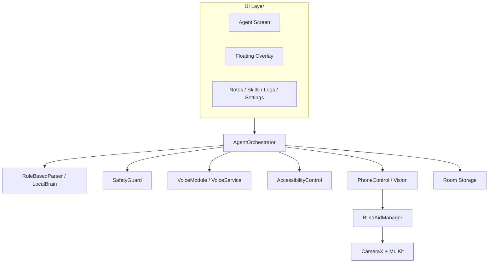

<div align="center">

# UnoOne Agent

### Your Phone. Your Intelligence. Your Privacy.

> A local-first Android AI companion for voice commands, deep app control, and sensory blind-aid navigation.

<p align="center">
  
  
  
  
</p>

<p align="center">
  
  
  
  
</p>

</div>

## Quick Navigation

- [Executive Snapshot](#executive-snapshot)
- [What UnoOne Delivers](#what-unoone-delivers)
- [Language Support Matrix](#language-support-matrix)
- [Architecture Design](#architecture-design)
- [Blind Aid Vision Deep Dive](#blind-aid-vision-deep-dive)
- [Voice Pipeline](#voice-pipeline)
- [Hardware Requirements](#hardware-requirements)
- [Security and Permission Model](#security-and-permission-model)
- [Build and Validation](#build-and-validation)

## Executive Snapshot

UnoOne is built as a modular on-device Android agent that combines:

- privacy-first command execution
- accessibility-based deep UI control
- live camera-aided sensory navigation
- local persistence and safety-gated automation

The workspace has two core documentation entry points:

- root overview (this file)
- Android implementation details: `android-app/UnoOneAgent/README.md`

## What UnoOne Delivers

| Capability | Current delivery status |
|---|---|
| Compose app shell + floating overlay | Implemented |
| 8-step command orchestrator | Implemented |
| Accessibility deep actions (tap, type, fill, swipe, read) | Implemented & Optimized |
| Blind Aid live CameraX + analyzer workflow | Implemented & Live |
| Rule-based parser with blind-aid trigger fixes | Implemented & Verified |
| Parser unit tests for blind-aid and note intent | Implemented & 100% Passed |

### Runtime truth notes

| Area | Actual runtime behavior today |
|---|---|
| In-app voice path | **Fully Active & Optimized**: Custom visualizer amplitude animation is binded directly to fallback SpeechRecognizer's decibel levels. Uses a conflict-free pipeline that prevents microphone device resource locks. |
| Background wake-word service | **Fully Connected & End-to-End**: VoiceService's VAD/STT outputs are securely broadcasted package-locally and processed immediately on the main thread via a secure BroadcastReceiver in the application scope. |
| LocalBrain inference | ONNX wrapper exists; `runInference()` currently returns a mock JSON placeholder |
| RAG and diagnostics | `RAGManager` and `Diagnostics` utilities exist but are not broadly integrated into orchestrator runtime flow |

## Language Support Matrix

### Speech Recognition (Android fallback path)

Configured language hints in code:

- English (India): `en-IN`
- Hindi: `hi-IN`
- Tamil: `ta-IN`
- Telugu: `te-IN`
- Kannada: `kn-IN`
- Malayalam: `ml-IN`
- Bengali: `bn-IN`

### Speech Synthesis (Android fallback mapping)

Explicit mappings in code:

- English (India): `en-IN`
- Hindi: `hi-IN`
- Tamil: `ta-IN`
- Telugu: `te-IN`

Note:

- additional language behavior may be available from device-level TTS/STT engines, but the matrix above reflects explicit code mappings/hints.

## Architecture Design



### Module map (13 modules)

| Module | Responsibility |
|---|---|
| `:app` | Compose UI, overlay service, orchestration, permission handling |
| `:core` | shared models and logging primitives |
| `:storage` | Room DB entities and DAOs |
| `:modelmanager` | model folder detection, checksum verification, storage usage |
| `:localbrain` | parser, prompt helpers, ONNX wrapper, RAG utility layer |
| `:voice` | recorder, STT/TTS engines, foreground voice service |
| `:agentrouter` | tool registration and fallback routing |
| `:safetyguard` | risk policy classifier |
| `:phonecontrol` | intents, OCR, object detection, blind aid analyzer |
| `:memory` | preference/correction/pattern retrieval |
| `:skills` | skill CRUD and trigger execution |
| `:observability` | local diagnostics helpers |
| `:accessibilitycontrol` | gestures, input, context capture, visible text extraction |

## Blind Aid Vision Deep Dive

### Command and state flow

1. parser maps activation phrases to `detect_objects`
2. parser maps stop phrases to `deactivate_blind_aid`
3. orchestrator toggles blind-aid state and speaks status
4. UI mounts `BlindAidCameraPreview` when active

### Camera and analyzer flow

`BlindAidCameraPreview`:

- binds `Preview` + `ImageAnalysis` via `ProcessCameraProvider`
- uses `STRATEGY_KEEP_ONLY_LATEST`
- unbinds camera providers on dispose
- releases `BlindAidManager` on teardown

`BlindAidManager`:

- processes 1 frame out of every 6 (about 5 FPS at 30 FPS input)
- runs ML Kit object detection on-device
- tries custom local model at:
  - `Android/data/com.unoone.agent/files/models/gemma-local/custom_yolov8.tflite`
- falls back to default ML Kit detector if custom model is absent
- computes obstacle proximity from fill ratio
- emits feedback channels:
  - haptics (vibration motor intensity)
  - tone beeps (sound generator dynamic rates)
  - spoken guidance (distance alert thresholds)

### Important safety & UI behaviors

- **Activation**: Falls under explicit `STRONG_CONFIRM` in `SafetyGuard.kt` (requiring the user to type `"confirm"` and allow) as a strict user-privacy protection check for continuous camera and microphone access.
- **Deactivation**: Registered under `DIRECT` risk policy, allowing instant deactivation via voice or overlay click without confirmation hurdles.
- **Visuals**: Bounding boxes are computed dynamically. Note that no custom Compose-rendered overlay borders are currently drawn over the live preview.

## Voice Pipeline

### In-app mic path

- `VoiceModule.startRecording(context, scope)`
- `VoiceModule.stopAndTranscribe()`
- amplitude updates are driven from Android STT `onRmsChanged` in fallback path

### Background service path

`VoiceService` includes:

- wake-word + VAD loop scaffolding
- Sherpa STT/TTS init attempts
- callback hooks for wake-word and command events

Integrated Pipeline:

- Broadcasts verified commands securely using package-local Intents, caught by the application's global `BroadcastReceiver` in `UnoOneApplication` to launch hands-free command executions instantly on the main thread.

## Hardware Requirements

| Tier | Recommended profile |
|---|---|
| Baseline (functional) | Android 9+ (API 28), ARM64, 4 GB RAM, 1 GB free storage, microphone |
| Recommended (smooth blind-aid + voice UX) | Android 12+, 6 to 8 GB RAM, rear camera, vibration motor, 2+ GB free storage |
| Expert local-model tier | 8+ GB RAM (12+ preferred), NPU-capable chipset, additional multi-GB model storage |

## Security and Permission Model

### Manifest-declared permissions include

- `RECORD_AUDIO`, `MODIFY_AUDIO_SETTINGS`
- `CAMERA`, `VIBRATE`
- `READ_CONTACTS`
- `READ_CALENDAR`, `WRITE_CALENDAR`
- `SYSTEM_ALERT_WINDOW`
- `FOREGROUND_SERVICE`, `FOREGROUND_SERVICE_MICROPHONE`
- `POST_NOTIFICATIONS`
- `REQUEST_IGNORE_BATTERY_OPTIMIZATIONS`
- storage compatibility permissions for model directories

### Safety behavior

- explicit rules in `SafetyGuard` map tools to `DIRECT`, `CONFIRM`, `STRONG_CONFIRM`, `BLOCK`
- unknown tool names default to `STRONG_CONFIRM`
- accessibility actions require explicit user enablement
- screen capture path now filters visible nodes and truncates very large payloads

## Models and Storage

Expected app-managed model folders:

- `gemma-local`
- `sherpa-asr`
- `sherpa-tts`
- `vad`
- `punctuation`
- `ocr-optional`

Workspace optimization file:

- `android-app/UnoOneAgent/.aiexclude` excludes heavy build/cache/model paths from AI context scanning

## Build and Validation

Run from `android-app/UnoOneAgent`:

```bash
./gradlew.bat :app:testDebugUnitTest
./gradlew.bat :app:compileDebugKotlin
```

## Canonical Android Technical README

For implementation-level module details:

- `android-app/UnoOneAgent/README.md`
